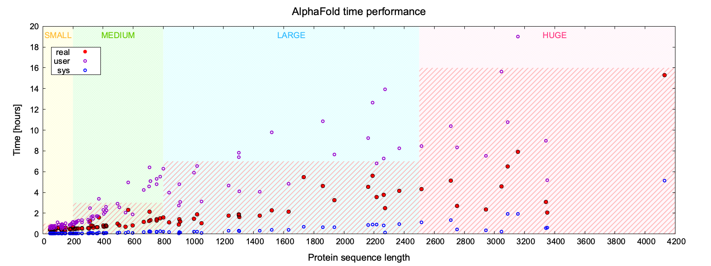

# Performance of the AlphaFold
[]

## Benchmark dataset of proteins

To get a better idea of AlphaFold's performance on HPC infrastructure, I ran on *Nova* cluster a benchmark of 100 proteins differentiated by:
* size ranging from 46 to over 4000 amino acids in the single protein chain
  * the reference X-Ray structure for small and medium proteins is below 1Å
  * the reference X-Ray structure for large and huge proteins is between 2Å and 3Å
* SCOPE class, including proteins of various secondary structure content
* several membrane proteins are included

| TYPE | SIZE | PDB |
|---------|---------|---------|
| SMALL | <=200 | 1EJG, 3PSM, 2PYA, 2GB1, 1KTH, 1VB0, 1F94, 1AHO, 1C75, 1L9L, 1OK0, 1R6J, 2FLA, 1U2H, 1SFD, 1TQG, 1MC2, 1UNQ, 3WDN, 1LUQ, 2YKZ, 4QB3, 1W0N, 3G46, 2NRL, 4G78, 1XG0, 1X8P, 3AKS, 2H5C |
| MEDIUM | <=800| 1BSM, 2VHK, 1IW0, 1C1K, 1FN8, 1PQ5, 1FCX, 1LUG, 3K34, 2V8T, 1AIG, 3O4P, 1BXO, 1GVT, 1K5C, 3M5Q, 1KWF, 1HZ4, 1F25, 1H12, 3VLA, 5R1V, 1AF6, 5U3A, 1GKM, 1HBN, 1GQ1, 7B1S, 3JU4, 4C5S, 1H2W, 2CHN, 1E3H, 1RWA, 1EU1, 2ZKM |
| LARGE | <2500 | 1F8N, 4FYR, 3FC4, 3WEO, 3OG2, 1GTE, 6J33, 6X9A, 1T3T, 3UGJ, 4LGY, 5W1H, 1OFD, 5B2O, 1TWF, 6FB3, 6FSA, 7NJ1, 4O9X, 7OEA, 5AMR, 7M1Q, 6Z2W |
| HUGE | >2500 | 6RW6, 7POG, 7N4Y, 6SKY, 7CPX, 7NI5, 6X9O, 3VKG, 6Z3R, 7PW8, 7OTW |

## Running time

The plot below shows the performance of AlphaFold running time depending on the size of modeled protein.
  The graph was prepared using Gnuplot *(see [Gnuplot tutorial]() in the Visualization section of the Bioinformatics Workbook for more details).*

The graph is divided into sections corresponding to categories of proteins based on their sequence length:  SMALL (yellow), MEDIUM (green), LARGE (blue), HUGE (pink). The three data series correspond to the measured times for each AlphaFold job: real (red filled circle), user (purple circle), and sys (blue circle) respectively.

* ***real time*** corresponds to the effective clock time and suggests what time allocation should be reserved in option `#SBATCH --time=`.  
* ***user time*** corresponds to the amount of CPU time spent in user-mode code (outside the kernel) within the process and suggest whether to increase the number of parallel tasks in option `#SBATCH --ntasks=` and memory allocation in option `#SBATCH --mem=`.
* ***sys time*** corresponds to amount of CPU time spent in the kernel within the process and is flat regardless of the size of the modeled protein.

Time is expressed in hours. The areas highlighted in red striped pattern indicate the average upper limit of time needed to predict the structure of a protein in a given size category.    
The format required by SLURM for `#SBATCH --time=` option is `days-hours:minutes:seconds`.     
In general, SMALL proteins (less than 200 amino acids) require less than an hour `1:0:0`, MEDIUM proteins (200-800 amino acids) should be completed within 3 hours so reserve up to `5:0:0`, for most LARGE proteins (800-2500 amino acids), 7 hours should be sufficient but better ask for `10:0:0`, and for HUGE proteins (more than 2500 amino acids) it is safer to reserve a full day `1-0:0:0` while increasing the number of tasks and memory. Extend the runtime if needed.

---

[Table of contents](../index.md){: .btn  .btn--primary}
[AlphaFold index](Alphafold-landingPage.md){: .btn  .btn--primary}
